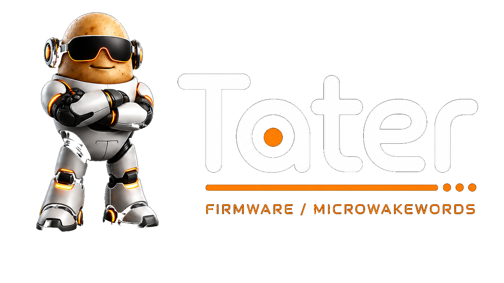

  

<h3 align="center">
  <a href="https://taterassistant.com">taterassistant.com</a>
</h3>

---

## Repository Archived

This repository is no longer the active firmware home for Tater satellites.

Tater has moved away from ESPHome-based firmware and now uses native firmware for supported satellite hardware such as VoicePE, Sat1, ReSpeaker devices, and S3 Box display satellites.

**[Tater Native Firmware](https://github.com/TaterTotterson/Tater-Native-Firmware)**

## Home Assistant Users

This repository is no longer maintained as a Home Assistant voice satellite firmware path. To use these satellites with Tater, flash Tater Native Firmware and connect Home Assistant to Tater if you want Home Assistant in the loop.

- **Tater:** [https://github.com/TaterTotterson/Tater](https://github.com/TaterTotterson/Tater)
- **Tater Native Firmware:** [https://github.com/TaterTotterson/Tater-Native-Firmware](https://github.com/TaterTotterson/Tater-Native-Firmware)

## Status

Archived. No new wake-word requests, ESPHome YAML updates, or Home Assistant satellite firmware changes are planned here.
